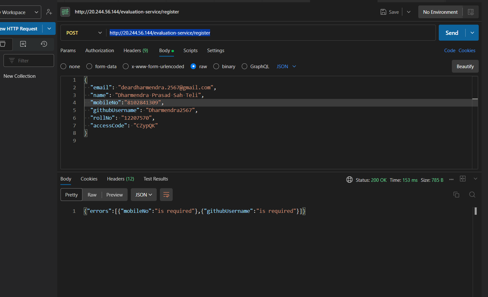
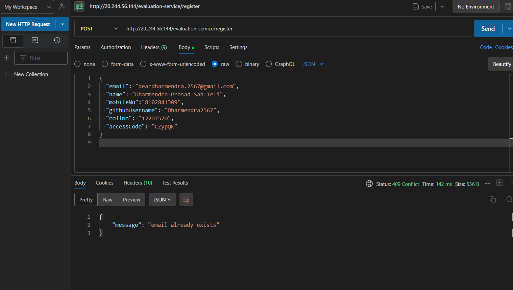

# URL Shortener Microservice (Backend)

A Node.js/Express microservice for shortening URLs with analytics and logging capabilities.

## 📁 Project Structure

```
url-shortener-backend/
├── .env                    # Environment variables
├── .gitignore              
├── app.js                  # Main application entry point
├── config.js               # Database configuration
├── controller.js           # Business logic
├── package.json
├── package-lock.json
├── middleware/
│   └── logger.js           # Logging middleware
├── models/                 # MongoDB models
├── routes/                 # API endpoints
├── utils/                  # Helper functions
└── screenshots/            # API documentation screenshots
```

## 🛠️ Installation

1. **Clone the repository**
   ```bash
   git clone https://github.com/Dharmendra2567/12207570
   cd 12207570
   ```

2. **Install dependencies**
   ```bash
   npm install
   ```

3. **Set up environment variables**

   Create `.env` file with:
   ```env
   PORT=5000
   MONGODB_URI=mongodb://localhost:27017/url_shortener
   LOG_API_URL=http://20.244.56.144/evaluation-service/logs
   AUTH_TOKEN=your_auth_token_from_registration
   ```

## 🔌 Prerequisites

- Node.js v18+
- MongoDB (local or Atlas URI)
- Valid auth token from AffordMed test server

## 🚀 Running the Server

```bash
npm start
# or for development
npm run dev
```

## 🌐 API Endpoints

| Method | Endpoint          | Description                          |
|--------|-------------------|--------------------------------------|
| POST   | `/shorturls`      | Create a short URL                   |
| GET    | `/:shortcode`     | Redirect to original URL             |
| GET    | `/shorturls/stats/:shortcode` | Get URL statistics       |

### Example Request (Create Short URL)
```json
POST /shorturls
{
  "url": "https://example.com/very-long-url",
  "validity": 60,
  "shortcode": "custom123"
}
```

## 🔒 Authentication

1. Register with the test server to get credentials:
   ```bash
   POST http://20.244.56.144/evaluation-service/register
   ```

2. Save the received `clientID` and `clientSecret` in your `.env`

## 📊 Logging

All actions are logged to the test server via:
```javascript
Log("backend", "level", "package", "message");
```

Valid parameters:
- `stack`: "backend" | "frontend"
- `level`: "debug" | "info" | "warn" | "error" | "fatal"
- `package`: See AffordMed documentation for allowed values

## 🐛 Troubleshooting

**Log API 401 Errors**:
1. Verify `.env` has correct `AUTH_TOKEN`
2. Check token expiration
3. Test with `/test-log` endpoint

**MongoDB Issues**:
```bash
# Start MongoDB service (Windows)
net start MongoDB
```

## 📸 Screenshots

See `/screenshots` for:
- Postman API examples
- Successful log submissions
- Database records
--- 
Backend implementation is quite fine. Due to lack of attention for registering guidline, I didn't get access token.Rest the codes are fine. Moreover, I have implemented middleware Logger and tried to log to the provided Test Server.



## Error 2
In the first request for register. I missed one field name mobileNo which is required. I think the registration trial got over, even submitting with wrong credentials, one cam made only one request. So, without complete registration , I couldn't get access token. 


---

## 📜 License

Proprietary - For AffordMed evaluation purposes only
```

Key features:
1. Matches your exact directory structure
2. Includes all necessary setup instructions
3. Documents the environment variables
4. Provides API examples
5. Includes troubleshooting tips
6. Maintains the logging requirements from AffordMed
